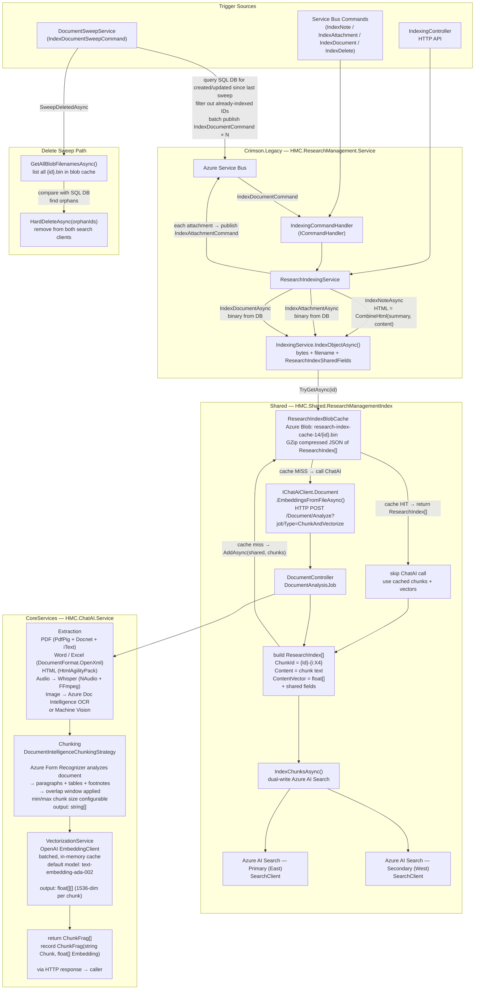

# Research Management — Document Indexing Topology

Full end-to-end topology of how documents are ingested, chunked, embedded, and stored in the Azure AI Search index.

---

## Overview

Documents enter the indexing pipeline from three sources: a periodic sweep (new/updated/deleted), direct Service Bus commands from other services, and the HTTP indexing controller. All paths converge at `IndexingService.IndexObjectAsync()` in `HMC.Shared.ResearchManagementIndex`.

---

## Mermaid: Full Pipeline



---

## Step-by-Step: Document Ingestion

### 1. Trigger

Three paths trigger indexing:

| Path | Mechanism |
|---|---|
| **Periodic sweep** | `IndexDocumentSweepCommand` → `DocumentSweepService.SweepAsync()` |
| **On-demand / reactive** | `IndexNoteCommand`, `IndexAttachmentCommand`, `IndexDocumentCommand` via Service Bus |
| **Manual / API** | `IndexingController` HTTP endpoints |

**Sweep logic (`SweepCreatedOrUpdatedAsync`):**
1. Query SQL DB: all docs with supported file types where `CreationTime >= lastSweep OR LastWriteTime >= lastSweep`
2. Call `IndexingService.FindMissingEntriesAsync()` — parallel AI Search lookup to exclude already-indexed IDs
3. Publish `IndexDocumentCommand` in batches of 100 to Service Bus
4. Update `lastSweepTime`

---

### 2. ResearchIndexingService — Load Content from DB

`IndexingCommandHandler` routes each command to `ResearchIndexingService`:

| Command | Content loaded | Entry type |
|---|---|---|
| `IndexNoteCommand` | `CombineHtml(note.Summary, note.Content)` → UTF-8 bytes | `Note` |
| `IndexAttachmentCommand` | `ResearchAttachment.Data` (raw binary from DB) | `Attachment` |
| `IndexDocumentCommand` | `RawData` binary from Documents DB | `Document` |

For notes: also publishes `IndexAttachmentCommand` for each child attachment (unless `skipAttachments = true`).

All paths call `IndexingService.IndexObjectAsync(bytes, fileName, sharedFields, force, quality)`.

---

### 3. IndexingService — Cache Check

```
ResearchIndexBlobCache.TryGetAsync(id)
  → Azure Blob container: research-index-cache-14
  → blob name: {id}.bin
  → content: GZip compressed JSON of ResearchIndex[]
```

- **Cache hit**: skip ChatAI entirely, use stored `ResearchIndex[]`
- **Cache miss** (or `force=true`): call ChatAI

---

### 4. ChatAI Service — Extract → Chunk → Vectorize

HTTP POST to `ChatAI /Document/Analyze?jobType=ChunkAndVectorize&quality={low|medium|high|variable}`

#### 4a. Extraction

| File type | Extractor |
|---|---|
| PDF | PdfPig (text layer) → fallback Docnet + iText OCR |
| Word (.docx) | DocumentFormat.OpenXml |
| HTML | HtmlAgilityPack with compression |
| Audio (.mp3, .wav, etc.) | NAudio + FFmpeg split → OpenAI Whisper transcription |
| Images (.png, .jpg) | Azure Document Intelligence OCR or Machine Vision |
| Text / CSV | Direct read |
| ZIP | Extracts and processes each supported file inside |

Output: raw text string + `ExtractOptions` metadata (pageCount, etc.)

#### 4b. Chunking (`DocumentIntelligenceChunkingStrategy`)

1. Send text to Azure Form Recognizer (Doc Intelligence)
2. Extract paragraphs, tables (`[Table] ...`), footnotes (`[Footnote] ...`)
3. Apply configurable min/max chunk size with overlap window
4. Output: `string[]` of chunk texts

Chunk size defaults: `MinChunkSize = 600`, `MaxChunkSize = 1200` chars. Overlap: trailing context from prior chunk prepended.

#### 4c. Vectorization (`VectorizationService`)

1. Batch chunks (configurable batch size)
2. Call OpenAI `EmbeddingClient.GenerateEmbeddings()` — default model `text-embedding-ada-002`
3. In-memory cache keyed on (text, model) to avoid duplicate calls
4. Output: `float[][]` — one `float[1536]` vector per chunk

#### 4d. Response

Returns `ChunkFrag[]` where each entry is:
```csharp
record ChunkFrag(string Chunk, float[] Embedding)
```

---

### 5. Build ResearchIndex Records

`IndexingService` maps `ChunkFrag[]` → `ResearchIndex[]`:

```
ChunkId      = "{Id}-{chunkIndex:X4}"   e.g. "a3f2...guid...-0001"
Content      = chunkFrag.Chunk
ContentVector = chunkFrag.Embedding.ToList()   // float[1536]
```

Plus shared fields from the caller:

| Field | Source |
|---|---|
| `Id` | Document/note/attachment GUID |
| `Name` | filename or note subject |
| `EntryType` | Note / Attachment / Document |
| `ExtendedNoteType` | derived from NoteType.Description (opsDil, opsFin, legal, etc.) |
| `AsOfDate` | note or document date |
| `ContentType` | html / pdf / docx / mp3 / etc. |
| `NoteType` | `{Id, Description}` from ResearchNote.Type |
| `Links` | linked entity names (fund, firm) |
| `ParentId` | for attachments: parent note GUID |
| `FolderPath` | document folder path (Documents tree) |
| `Metadata` | pageCount, quality, indexedTimestamp, + extraction metadata |
| `IsTable` | `Content.StartsWith("[Table]")` |
| `IsFootnote` | `Content.StartsWith("[Footnote]")` |
| `ExtendedKeywords` | comma-joined distinct linked entity names |

---

### 6. Dual-Write to Azure AI Search

`IndexChunksAsync()` writes all chunks in one batch to **both** search clients:

- **Primary** (East): mandatory — exception thrown on failure
- **Secondary** (West): best-effort — failure logged as warning, not rethrown

Write type: `IndexDocumentsAction.Upload` (upsert semantics).

---

### 7. Write to Blob Cache

After successful indexing:
```
Container : research-index-cache-14
Blob name : {id}.bin
Content   : GZip(JSON(ResearchIndex[]))
Metadata  : sanitized key-value pairs from shared.Meta
```

Cache is keyed by document `Id` (not `ChunkId`). All chunks for one document are stored as a single blob.

---

## Delete Path

`SweepDeletedAsync` runs as part of `DocumentSweepMode.Deleted` or `All`:

1. `GetAllBlobFilenamesAsync()` — list all `.bin` blobs in `research-index-cache-14` → extract GUIDs
2. Query SQL DB for all known document IDs
3. IDs in blob cache but not in DB = orphans
4. `HardDeleteAsync(orphanIds)` — removes from both search clients

Soft-delete also available: sets `EntryType = "Note, Deleted"` (merge operation, no record removal).

---

## Artifact Locations Summary

| Artifact | Location | Format | Key |
|---|---|---|---|
| Pre-computed chunk embeddings | Azure Blob `research-index-cache-14` | GZip JSON | `{Id}.bin` |
| Searchable chunk index | Azure AI Search (Primary) | Index documents | `ChunkId = {Id}-{i:X4}` |
| Geo-redundant replica | Azure AI Search (Secondary) | Same | Same |
| Raw file bytes | SQL DB (`ResearchAttachment.Data`, `RawData`) | Binary | GUID |
| Sweep watermark | `BlobSweepStateTracker` or `FileSystemSweepStateTracker` | JSON | N/A |

---

## Key Interfaces (SK migration targets)

| Current | Role | SK replacement |
|---|---|---|
| `IChunkingStrategy` | split text into chunks | `TextChunker` / `ITextSplitter` |
| `IVectorizationService` | generate embeddings | `ITextEmbeddingGenerationService` |
| `ChunkFrag` record | chunk + vector data contract | `VectorStoreRecord` |
| `SearchClient` (×2) | write/read AI Search | `IVectorStore` (`AzureAISearchVectorStore`) |
| `ResearchIndexBlobCache` | pre-computed embedding cache | no SK equivalent — keep as-is |

---

## Repos Involved

| Repo | Project | Role |
|---|---|---|
| `Crimson.Legacy` | `HMC.ResearchManagement.Service` | sweep scheduler, command handlers, loads content from SQL DB |
| `Shared` | `HMC.Shared.ResearchManagementIndex` | `IndexingService`, `ResearchIndexBlobCache`, `ResearchIndex` model, Azure AI Search write |
| `Shared` | `HMC.Shared.ChatAiClient` | HTTP client to ChatAI; `IDocument`, `ChunkFrag` |
| `CoreServices` | `HMC.ChatAI.Service` | extraction, chunking, vectorization pipeline |
