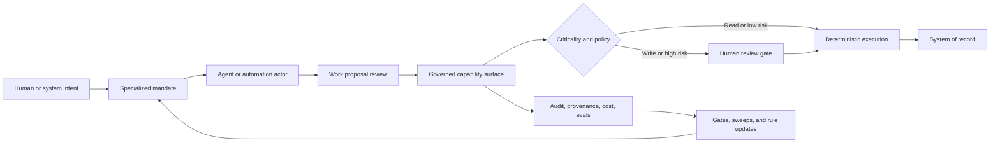

# Agent Conference 2026: Everything Distilled

Prepared for HMC leadership

May 7, 2026

## The Read

Agent Conference 2026 did not validate a simple "agents everywhere" roadmap.

It surfaced a production architecture: agents are non-human actors that need to operate inside explicit identity, capability, context, validation, observability, infrastructure, and human-review boundaries. The strategic work is not choosing the cleverest agent. The strategic work is building the control plane that lets agents, automations, scheduled jobs, and tool-using LLM systems act safely under delegated authority. [1], [2], [3], [4], [5], [6], [8]

HMC should not assume that existing APIs, wrappers, or integration layers are agent-ready. Today, these surfaces are mostly understood as application plumbing: ways for software systems, services, or users to reach data and perform work. That is not sufficient for non-human actors. [1], [2], [4], [6], [7], [8]

The strategic move is to define a new design standard: governed capability surfaces. A capability is not just an endpoint. It is a named action with typed input, typed output, known side effect, ownership, policy, actor constraints, audit events, criticality classification, and rollback or compensation behavior.

This model is not yet socialized. That is the point. The near-term work is to introduce the concept, test it in one bounded pilot, and decide which existing system-access surfaces could be refactored or wrapped into this model over time.

## Human-Agent Capture

This work product is also evidence of a method.

The conference was captured as a human-agent research pair. The human did the live work: choosing rooms, sensing credibility, noticing energy, recording audio, photographing slides, and marking what felt actionable in motion. The agent did the compression work around the capture: normalizing notes, reconciling schedules, indexing sources, extracting claims, preserving caveats, and turning the firehose into inspectable synthesis. [1], [9], [12], [13], [14], [15]

That pairing is a small working example of the broader enterprise pattern: keep human judgment at the center, give the agent structured work, preserve provenance, and use the machine to carry volume without flattening meaning.

## The Pattern

The key move is specialization first. Broad generalist agents create review debt. Specialized agents or automations should operate under clear mandates, route proposed work through a governed review queue, and hand known procedures to deterministic systems below a governed boundary. RingCentral called part of this swarm-level reflection; the reusable HMC idea is managed review of non-human work proposals, not free-form agent chatter. [4], [6], [8], [11], [14], [15]

## What Carries Forward

1. Agents are actors, not users.
   Authorization has to distinguish the human subject, the agent actor, delegated authority, tool invocation, and system of record. Static keys and broad service accounts are the wrong abstraction. [5], [8], [12], [15]

2. Agents need capabilities, not raw access.
   The repeatable pattern is narrow, typed, policy-aware capability surfaces with known side effects, audit trails, and human-review gates where needed. [1], [2], [6], [7], [8]

3. Context is infrastructure.
   Retrieval is not a decorative RAG layer. Production context needs provenance, permissions, freshness, versioning, metadata scale, latency targets, cost controls, and downstream references. [3], [5], [6], [8], [10], [15]

4. Validation is the bottleneck.
   AI accelerates candidate work first. The scarce capacity becomes review, testing, recovery, security, taste, and operational confidence. The fastest is wrong if validation cannot keep up. [3], [5], [6], [8], [12], [13], [14], [15]

5. Domain rules are the durable asset.
   The scarce resource is not tokens. It is domain rules. SME knowledge should become reusable skills, encoded decision procedures, eval fixtures, and capability policies. [3], [5], [8], [12]

6. Infrastructure load changes shape.
   Humans pause. Agents do not. Agent populations can retry, inspect, call tools, generate traces, and pressure databases, APIs, queues, auth, CI, observability, and budgets continuously. [4], [6], [8], [11], [14], [15]

7. Use-case selection is moral architecture.
   The same substrate can reduce toil and improve reliability, or it can become deflection, surveillance, and containment. The safer starting point is toil and reliability, not opaque authority. [3], [4], [5], [6], [8]

## HMC Moves

- Pick one bounded toil pilot with a named owner, measurable success criteria, small blast radius, and a proposal-first or read-only starting mode.
- Define a capability registry standard: owner, input/output contract, side-effect class, permissions, actor policy, audit fields, rollback path, and criticality level.
- Establish agent identity and gateway policy before any broad write access: subject/actor separation, delegated authority, scoped permissions, immutable audit, prompt-injection response, and destructive-action handling.
- Treat context provenance as platform infrastructure: source ID, version, permission, freshness, index version, and output references.
- Turn evals into guardrails: variance checks, repeatability checks, replay, gates, sweeps, and incident-response loops.
- Capture SME rules as durable assets: reusable skills, domain-rule libraries, agent asset repositories, and encoded decision procedures.
- Measure the pilot by control-plane maturity, not agent novelty: review burden, cost, latency, failure class, policy hit rate, human intervention, and recovered toil.

## Field Signals

These are field signals, not endorsements.

- Apollo: agents need cockpits, not keys to the building. API descriptions can become mediated capabilities only if schema, identity, runtime boundary, audit, and replay surround them. [6], [7], [11]
- NVIDIA: internal CLI-style tools spread when developers had a harness. The transferable lesson is Research, Gates, and Sweeps for accelerated generation. This signal is note-backed, not audio-backed. [6], [11], [13], [14]
- CircleCI/METR: subjective speed is not measured throughput. More generated code can increase review pressure and confidence gaps. [6], [8], [13], [15]
- MCP panel: MCP can be magic or tragic. Prompt injection will happen, tool sprawl will happen, and destructive actions need criticality policy. [6], [8], [13], [15]
- CockroachDB: humans breathe; agents do not. Agent-shaped traffic changes the load profile of shared systems. [6], [8], [11], [15]
- Monte Carlo: bad agent answers can be data failures in disguise. Agent readiness requires data, semantic, build, and trust observability. [6], [8], [13], [15]
- DataRobot: the demo is above the waterline. The production product is below it: identity, auth, audit, evals, governance, observability, CI/CD, connectors, and token economics. [5], [8], [10], [15]
- Bauplan: data agents need a safe failure surface: sandboxed state, lineage, reviewable deltas, checks, and controlled promotion before authoritative data is touched. [6], [8], [11], [15]
- LanceDB / You.com: context is a workload with scale, latency, provenance, and budget, not a vector-search checkbox. [5], [8], [10], [12], [15]
- Google commerce: customer-facing agents need structured data and deterministic executors, not one model wandering around the market with tools. [6], [11], [13], [14]
- RingCentral: specialize deeply. Agents should reason, research, hypothesize, and propose within mandates; deterministic systems should execute known procedures below a governed boundary. [4], [6], [8], [11], [14], [15]
- T-Mobile / Distyl: agency can become containment. Use-case choice determines whether the substrate liberates work or tightens control. [6], [11], [13], [14]

## Follow-Up Map

| Thread | Why to look | People / companies |
| --- | --- | --- |
| Mediated capabilities | Best architectural bridge from API access to governed non-human action | Apollo GraphQL; Matt DeBergalis |
| Agentic coding operations | CLI adoption, gates, sweeps, review pressure, and accelerated generation | NVIDIA; Julie Yaunches; CircleCI; METR |
| Data-agent safety | Safe failure, branchable data work, lineage, promotion, and trust | Bauplan; Ciro Greco; Monte Carlo; Barr Moses |
| Context infrastructure | Retrieval workload, provenance, cost, search economics, and metadata scale | LanceDB; Chang She; You.com; Saahil Jain |
| Enterprise runtime substrate | Identity, governance, evals, observability, CI/CD, connectors, and economics | DataRobot; Venky Veeraraghavan; Datadog; Ameet Talwalkar |
| Multi-agent management | Specialized mandates, work-proposal review, quality gates, and deterministic execution boundary | RingCentral; Mayank Agarwal |
| Operations and tool governance | MCP, SRE agents, incident response, prompt injection, and destructive-action policy | PagerDuty; Ralph Bird; MCP panel |
| Customer-agent risk | Scale, agency, containment, and customer-impact boundaries | T-Mobile; Julianne Roberson; Distyl AI; Arjun Prakash |

## Caveats

- Vendor and product material is field signal, not procurement recommendation.
- NVIDIA CLI adoption details are note-backed, not audio-backed in the current corpus.
- The "1B tables" scale anecdote is preserved in the LanceDB raw-note block, but exact attribution remains unverified.
- OCR-backed slide wording should be checked before quotation.
- The noisy exhibit-hall capture should remain excluded from leadership material until separately reviewed.
- The HMC capability-surface recommendation is an HMC interpretation of the conference pattern, not a direct conference claim.

## Lines Worth Repeating

> Agents need cockpits, not keys to the building.

> The scarce resource is not tokens. It is domain rules.

> Today's evals are tomorrow's guardrails.

> Prompt injection will happen. Design the gateway.

> The fastest is wrong if validation cannot keep up.

> Humans breathe. Agents do not.

> Specialize the agents. Govern the capabilities. Keep execution deterministic where it can be.

## Closing Position

HMC should not rush to trust agents. HMC should shape the world agents are allowed to inhabit.

That world is made of governed capabilities, explicit identity, provenance-aware context, deterministic execution, evals, gates, sweeps, observability, infrastructure controls, and human judgment. The first durable win is not an impressive autonomous demo. It is a bounded pilot that proves the control plane.

## Appendix A: Evidence Sources

[1] `06_everything/agent-conference-2026-everything.md` - fuller executive packet with field texture, company/people indexes, caveats, and traceability.

[2] `05_outputs/agent-conference-2026.md` - claim-backed internal memo and traceability map.

[3] `04_analysis/day1-synthesis.md` - Day 1 interpretation grounded in extracted claims.

[4] `04_analysis/day2-synthesis.md` - Day 2 interpretation grounded in extracted claims, vendor claims, and slide claims.

[5] `03_extracted-claims/day1-claims.md` - Day 1 extracted claims.

[6] `03_extracted-claims/day2-claims.md` - Day 2 extracted claims.

[7] `03_extracted-claims/vendor-claims.md` - booth and vendor/hallway extracted claims.

[8] `03_extracted-claims/slide-claims.md` - image/OCR-derived extracted claims.

[9] `02_normalized/source-ledger.md` - source ledger for downstream traceability.

[10] `02_normalized/day1-timeline.md` - Day 1 source chronology.

[11] `02_normalized/day2-timeline.md` - Day 2 source chronology.

[12] `01_raw-evidence/notes/day1-notes.md` - raw Day 1 notes.

[13] `01_raw-evidence/notes/day2-notes.md` - raw Day 2 notes.

[14] `01_raw-evidence/notes/day2-notes-extended.md` - extended Day 2 notes and capture expansion.

[15] `01_raw-evidence/images/images-ocr.md` - OCR ledger for slide/image-derived evidence.

[16] `01_raw-evidence/notes/schedule.md` - raw schedule export used for timeline reconciliation.

## Appendix B: Claim Traceability

Claim IDs in this section resolve through the extracted-claims layer [5], [6], [7], [8]. Raw-source paths and normalized inventories are listed in Appendix A.

- Human-agent capture method: `D1-C001`, `D2-C001`, `D2-C016`
- Governed runtime / below-waterline stack: `D1-C010`, `SL-C006`, `SL-C007`, `SL-C010`, `SL-C011`, `SL-C014`
- Identity and delegated authority: `D1-C005`, `D1-C013`, `SL-C012`, `SL-C013`
- Capability mediation and HMC capability-surface interpretation: `D2-C005`, `V-C001`, `D2-C016`
- Context and retrieval infrastructure: `D1-C007`, `D1-C012`, `D2-C006`, `D2-C013`, `SL-C003`, `SL-C004`, `SL-C005`, `SL-C008`, `SL-C021`
- Toil-first pilot heuristic and durable domain-rule capture: `D1-C003`, `D1-C004`, `D1-C008`, `D1-C015`
- Data-agent safety surfaces: `D2-C007`, `SL-C015`, `SL-C016`, `SL-C017`
- Validation bottleneck, eval repeatability, and gates/sweeps: `D1-C011`, `D1-C014`, `D2-C010`, `D2-C012`, `SL-C009`, `SL-C019`, `SL-C020`
- Multi-agent specialization and work-proposal review: `D2-C015`, `SL-C023`, `SL-C024`, `SL-C025`, `SL-C026`
- MCP and gateway governance: `D2-C014`, `SL-C022`
- Infrastructure load: `D2-C011`, `SL-C018`, `V-C003`
- Deterministic execution boundaries: `D2-C009`, `D2-C015`, `SL-C023`, `SL-C024`, `SL-C025`, `SL-C026`
- Customer and banking risk boundary: `D2-C002`, `D2-C003`, `D2-C004`, `SL-C002`
- Vendor watchlist: `V-C001`, `V-C002`, `V-C003`, `V-C004`, `V-C005`
