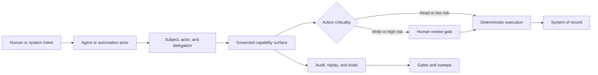
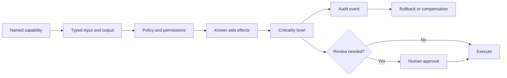
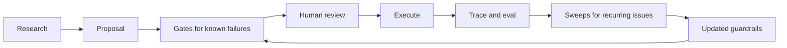

# Agent Conference 2026: Executive Distillation

Prepared for HMC leadership

May 7, 2026

## Opening Callout: Human-Agent Capture

The first finding is methodological.

This conference was captured as a human-agent research pair. The human did the live work that cannot be delegated cleanly: choosing rooms, sensing credibility, noticing energy, taking rough notes, recording audio, photographing slides, and deciding what felt actionable in motion. The agent did the compression work around the capture: normalizing notes, reconciling schedules, indexing sources, extracting claims, comparing talks across days, preserving caveats, and turning the firehose into an inspectable synthesis.

That pairing is not a footnote. It is a working demonstration of the enterprise pattern this memo recommends: keep human judgment at the center, give the agent structured work, preserve provenance, and use the machine to carry volume without flattening meaning.

The result was not a conference recap. It was source-backed operational intelligence. We drank from the firehose and came away unharmed. [1], [4], [5], [8]

## Executive Thesis

The conference did not make the case for agents everywhere.

It made the case for a governed execution architecture where agents are one class of non-human actor operating inside explicit identity, capability, context, validation, observability, infrastructure, and human-review boundaries. [1], [2], [3], [4], [5], [7]

The HMC move is not:

- pick a model;
- buy an agent platform;
- expose APIs to a chatbot;
- automate broad work because it looks impressive.

The HMC move is:

> Build the control plane that lets non-human actors act safely, measurably, and economically.

## Executive Visuals

Gates and sweeps showed up most concretely in the agentic-coding material, where accelerated generation creates review, validation, and drift pressure. The broader architectural lesson is portable: once agents increase the volume of proposed work, organizations need explicit gates for known failure modes and scheduled sweeps for recurring or cross-cutting issues. [3], [5], [7], [15], [16], [18]

## What The Evidence Suggests

1. Agents are actors, not users.
   Authorization must distinguish the human subject, the agent actor, the delegated authority, the tool invoked, and the system of record touched. Static keys and broad service accounts are not an agent identity model. [4], [7], [14], [18]

2. Agents need mediated capabilities, not raw system access.
   The conference repeatedly pointed to governed capability surfaces: narrow, typed, policy-aware actions with known side effects, audit trails, and human-review boundaries where needed. HMC may already have early primitives for this pattern in existing surfaces that mediate system access, but that is an HMC interpretation and proposed direction, not a direct conference claim. [1], [3], [5], [6], [13]

3. Context is infrastructure.
   Retrieval is no longer "RAG garnish." Production context needs provenance, permissions, freshness, versioning, metadata scale, latency targets, budget controls, and explainability. [2], [3], [4], [5], [7], [11], [18]

4. Validation is the new bottleneck.
   AI accelerates candidate work first. The scarce capacity becomes review, testing, recovery, security, taste, and operational confidence. The fastest is wrong if validation cannot keep up. [2], [3], [4], [5], [7], [14], [15], [16], [18]

5. Agent traffic changes infrastructure economics.
   Humans pause. Agents do not. Agent populations can retry, inspect, call tools, generate traces, and load databases continuously. Capacity planning must model agent-shaped load separately from human traffic. [3], [5], [6], [7], [10], [18]

6. Use-case selection is moral architecture.
   The same substrate can reduce toil, improve reliability, and help users, or it can become surveillance, deflection, and containment. The safer starting point is toil and reliability, not opaque authority or worker monitoring. [2], [3], [4], [5], [7]

## The HMC Strategic Move

Conference finding: production agents require governed capability surfaces.

HMC implication: the layers that mediate system access may become more strategically important than the agents themselves.

Proposed move: define a capability registry standard and test it against one bounded pilot.

The strategic opportunity is to evolve selected internal system-access surfaces into governed capability surfaces for non-human actors.

The design unit should not be the endpoint. It should be the capability: a named action with typed input, typed output, known side effect, owner, policy, audit event, criticality level, and rollback or compensation path.

That means moving from:

- endpoint catalogs to capability registries;
- credentials to subject/actor/delegation chains;
- prompt stuffing to governed context contracts;
- tool calls to auditable action events;
- direct writes to proposal-first workflows;
- one-off checks to evals, gates, sweeps, replay, and incident response;
- ad hoc SME knowledge to reusable skills, agent asset repositories, and encoded decision procedures.

The durable platform work is not a single impressive agent. It is the substrate that lets many bounded agents exist without surrendering control. [1], [2], [3], [4], [5], [7]

## Decision Points To Consider

1. A bounded toil pilot.
   The strongest candidate is work where success is measurable, the blast radius is small, and the first safe mode can be read-only or proposal-first.

2. A capability registry standard.
   Every exposed action would benefit from an owner, input/output contract, side-effect classification, permissions, actor policy, audit fields, rollback path, and criticality level.

3. Agent identity before agent write access.
   Broad autonomous write access is hard to justify without subject/actor separation, delegated authority, scoped permissions, immutable audit, and gateway policy.

4. Context provenance as platform infrastructure.
   Retrieval becomes more defensible when it carries source IDs, versions, permissions, freshness, index version, and downstream output references.

5. Eval and gateway standards before pilots multiply.
   Today's evals become tomorrow's guardrails. Prompt injection will happen. The gateway is the place to make that reality explicit.

## Low-Regret Next Moves

### Clarify The Pilot

- Pick one toil pilot with a named owner and measurable success criteria.
- Draft the HMC-safe agent execution standard.
- Create the first capability registry over a constrained domain.
- Define the minimum agent event schema: run ID, subject ID, actor ID, capability ID, context references, policy decision, cost, latency, human intervention, success/failure.
- Start SME/domain-rule capture for the pilot domain.

### Build The Safety Surface

- Build the pilot in proposal-first mode.
- Add provenance-aware retrieval for the pilot context.
- Add gateway policy for action criticality, destructive action handling, prompt-injection response, trace hygiene, and DLP.
- Add eval variance and repeatability checks, not just single-run pass/fail.
- Create reusable skills or encoded decision procedures from SME review.

### Decide What Scales

- Run gates and sweeps over agent-created artifacts.
- Review traces for review burden, cost, latency, and failure classes.
- Decide whether the pilot graduates, stays bounded, or gets shut down.
- Turn the pilot registry, events, evals, and gateway rules into reusable platform assets.
- Prepare leadership readout around control plane maturity, not agent novelty.

This sequence is grounded in the conference's repeated pattern: start with toil, make agent work reviewable, promote evals into guardrails, and keep gateway policy ahead of rollout. The gates-and-sweeps language is generalized from the agentic-coding material rather than presented as a direct claim about every domain. [2], [3], [4], [5], [7]

## Field Signals Executives Can Remember

These are field signals, not vendor endorsements.

- Apollo: agents need cockpits, not keys to the building. API descriptions can become mediated capabilities if schema, identity, runtime boundary, audit, and replay are built around them. [5], [6], [13]
- NVIDIA: internal CLI-style tools spread quickly once developers had a harness; the durable lesson is Research, Gates, and Sweeps as the operating model for accelerated generation. [5], [10], [15], [16]
- CircleCI/METR: subjective speed is not measured throughput. More generated code can increase review pressure and confidence gaps. [5], [7], [12], [18]
- MCP panel: MCP can be magic or tragic. Prompt injection will happen, tool sprawl will happen, and destructive actions need criticality policy. [5], [7], [12], [18]
- CockroachDB: humans breathe; agents do not. Agent-shaped traffic changes load on databases, APIs, queues, auth, CI, and observability. [5], [6], [7], [12], [18]
- Monte Carlo: bad agent answers can be data failures in disguise. Readiness needs data, semantic, agent-build, and trust observability in one debugging surface. [5], [7], [12], [18]
- DataRobot: the demo is above the waterline; the production product is below it: identity, auth, audit, evals, governance, observability, CI/CD, connectors, and token economics. [4], [7], [9], [18]
- Bauplan: data agents need a safe failure surface. Code agents can be wrong inside branches, diffs, tests, and pull requests; data agents need sandboxed state, lineage, reviewable deltas, checks, and controlled promotion before touching authoritative data. [5], [7], [10], [18]
- LanceDB / You.com: context is a workload with scale, latency, provenance, and budget, not a vector search checkbox. [4], [7], [9], [14], [18]
- Google commerce: customer-facing agents need structured data and deterministic executors, not one model wandering around the market with tools. [5], [10], [15], [16]
- T-Mobile / Distyl: agency can become containment. Use-case choice determines whether the substrate liberates work or tightens control. [5], [10], [15], [16]

## Vendor Watchlist

This is a follow-up list, not a procurement recommendation.

- Apollo: inspect the claimed Docker/appliance packaging and GitHub artifact. Strong architecture signal for candidate HMC capability surfaces, but implementation details need review. [6], [13]
- Dust / Agent OS: possible Stack AI replacement or comparison point. Deployment model remains unknown. [6], [13]
- LangSmith / LangChain: developer-facing tooling signal, plus pressure from no-code demand. Useful reference for self-service guardrail planning. [6], [13]
- CockroachDB: interesting infrastructure-load signal and Azure-deployable/Postgres-like positioning. Product fit remains unclear. [6], [13]
- Misc exhibit-hall capture: keep out of leadership material until separately reviewed. The capture is too noisy. [6], [13]

## Company And Reference Index

Convenience links for external companies and named external references in this distillation. These links are public official pages, not endorsements.

| Name | Why it appears | Link |
| --- | --- | --- |
| Monte Carlo | Data and AI observability field signal | https://www.montecarlodata.com/ |
| Apollo GraphQL | API orchestration / capability-surface field signal | https://www.apollographql.com/ |
| Bauplan | Data-agent safety surface / Git-for-data signal | https://www.bauplanlabs.com/ |
| NVIDIA | Agentic-coding CLI adoption and Research/Gates/Sweeps signal | https://www.nvidia.com/ |
| CircleCI | Validation bottleneck / speed-confidence signal | https://circleci.com/ |
| Cockroach Labs / CockroachDB | Agent-shaped infrastructure load signal | https://www.cockroachlabs.com/ |
| DataRobot | Below-waterline production substrate signal | https://www.datarobot.com/ |
| Distyl AI | T-Mobile agency-vs-containment field signal | https://distyl.ai/ |
| Dust | Vendor watchlist; Agent OS positioning captured in booth note | https://dust.tt/ |
| Google | Commerce / structured-data field signal | https://about.google/ |
| LanceDB | Context workload / retrieval infrastructure signal | https://www.lancedb.com/ |
| LangChain / LangSmith | Developer-facing agent observability and eval tooling signal | https://www.langchain.com/langsmith/ |
| METR | Measurement / validation signal paired with CircleCI material | https://metr.org/ |
| Model Context Protocol | Open standard referenced in MCP governance signal | https://modelcontextprotocol.io/ |
| T-Mobile | Customer-service agency-vs-containment field signal | https://www.t-mobile.com/about-us |
| You.com | Budget-aware search / context economics signal | https://you.com/ |

## Leadership Caveats

The architecture conclusions do not depend on exact vendor numbers, but the following should stay caveated before formal leadership or external use. [4], [5], [6], [7], [14], [15], [16], [18]

- NVIDIA CLI adoption details are note-backed, not audio-backed in the current corpus.
- The "1B tables" scale anecdote is preserved in the LanceDB raw-note block, but exact attribution remains unverified.
- OCR-backed slide wording should be checked before quotation.
- Vendor packaging, adoption, and performance claims should be treated as directional field signal until inspected.
- Bauplan's 90% agent-driven development framing should be handled as vendor-positioned.
- The noisy exhibit-hall capture should remain excluded from leadership material.

## Lines Worth Repeating

> Agents need cockpits, not keys to the building.

> The scarce resource is not tokens. It is domain rules.

> Today's evals are tomorrow's guardrails.

> Prompt injection will happen. Design the gateway.

> The fastest is wrong if validation cannot keep up.

> Humans breathe. Agents do not.

> Build the control plane, not the magic trick.

## Closing Position

The executive read is simple:

> HMC should not rush to trust agents. HMC should shape the world agents are allowed to inhabit.

That world is made of governed capabilities, explicit identity, provenance-aware context, deterministic execution, evals, gates, sweeps, observability, infrastructure controls, and human judgment.

That is the gemstone.

## Appendix A: Evidence Sources

[1] `05_outputs/agent-conference-2026.md` - full claim-backed internal memo and traceability map.

[2] `04_analysis/day1-synthesis.md` - Day 1 interpretation grounded in extracted claims.

[3] `04_analysis/day2-synthesis.md` - Day 2 interpretation grounded in extracted claims, vendor claims, and slide claims.

[4] `03_extracted-claims/day1-claims.md` - Day 1 extracted claims.

[5] `03_extracted-claims/day2-claims.md` - Day 2 extracted claims.

[6] `03_extracted-claims/vendor-claims.md` - booth and vendor/hallway extracted claims.

[7] `03_extracted-claims/slide-claims.md` - image/OCR-derived extracted claims.

[8] `02_normalized/source-ledger.md` - source ledger for downstream traceability.

[9] `02_normalized/day1-timeline.md` - Day 1 source chronology.

[10] `02_normalized/day2-timeline.md` - Day 2 source chronology.

[11] `02_normalized/image-index.md` - image inventory keyed by source ID.

[12] `02_normalized/audio-index.md` - audio transcript inventory keyed by source ID.

[13] `02_normalized/booth-index.md` - booth/vendor note inventory.

[14] `01_raw-evidence/notes/day1-notes.md` - raw Day 1 notes.

[15] `01_raw-evidence/notes/day2-notes.md` - raw Day 2 notes.

[16] `01_raw-evidence/notes/day2-notes-extended.md` - extended Day 2 notes and capture expansion.

[17] `01_raw-evidence/notes/schedule.md` - raw schedule export used for timeline reconciliation.

[18] `01_raw-evidence/images/images-ocr.md` - OCR ledger for slide/image-derived evidence.

[19] `01_raw-evidence/audio-transcripts/` - raw audio transcript captures.

[20] `01_raw-evidence/booth-notes/` - booth/vendor note captures.

[21] `01_raw-evidence/chat/` - chat exports used as raw supporting material.

## Appendix B: Claim Traceability

Claim IDs in this section resolve through the extracted-claims layer [4], [5], [6], [7]. Raw-source paths and normalized inventories are listed in Appendix A.

- Human-agent capture method: `D1-C001`, `D2-C001`, `D2-C016`
- Governed runtime / below-waterline stack: `D1-C010`, `SL-C006`, `SL-C007`, `SL-C010`, `SL-C011`, `SL-C014`
- Identity and delegated authority: `D1-C005`, `D1-C013`, `SL-C012`, `SL-C013`
- Capability mediation and HMC capability-surface interpretation: `D2-C005`, `V-C001`, `D2-C016`
- Context and retrieval infrastructure: `D1-C007`, `D1-C012`, `D2-C006`, `D2-C013`, `SL-C003`, `SL-C004`, `SL-C005`, `SL-C008`, `SL-C021`
- Toil-first pilot heuristic and durable domain-rule capture: `D1-C003`, `D1-C004`, `D1-C008`, `D1-C015`
- Data-agent safety surfaces: `D2-C007`, `SL-C015`, `SL-C016`, `SL-C017`
- Validation bottleneck and Research/Gates/Sweeps: `D1-C011`, `D2-C010`, `D2-C012`, `SL-C019`, `SL-C020`
- MCP and gateway governance: `D2-C014`, `SL-C022`
- Infrastructure load: `D2-C011`, `SL-C018`, `V-C003`
- Deterministic execution boundaries: `D2-C009`, `D2-C015`, `SL-C023`, `SL-C024`, `SL-C025`, `SL-C026`
- Customer and banking risk boundary: `D2-C002`, `D2-C003`, `D2-C004`, `SL-C002`
- Vendor watchlist: `V-C001`, `V-C002`, `V-C003`, `V-C004`, `V-C005`
