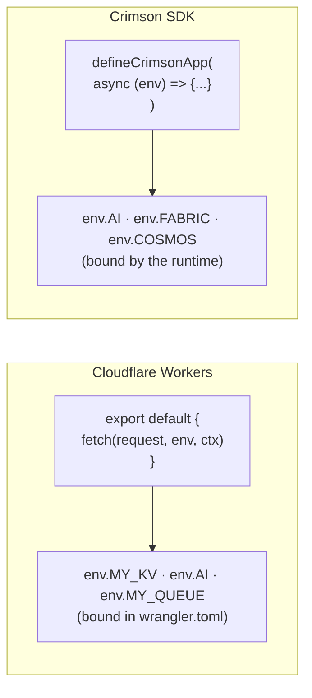
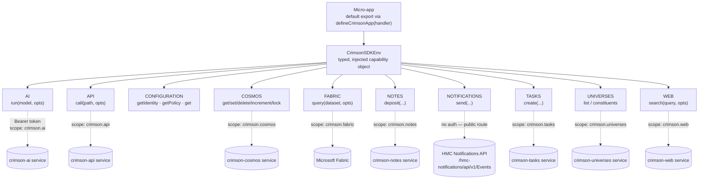
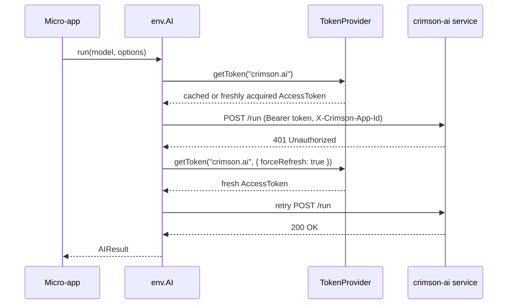
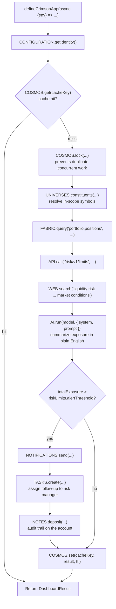

# Crimson SDK — A Bindings-Based Platform SDK for Employee-Built Micro-Apps

**Author:** Pete Jensen
**Date:** July 17, 2026
**Status:** Early sandbox / pitch (`repos/crimson-sandbox`, v0.1.0)

---

## Executive Summary

Crimson SDK is a proposal for a small, typed Deno/TypeScript SDK that lets employees who are *not* platform engineers build small internal tools — "micro-apps" — against HMC infrastructure (AI, live portfolio data, task/notification systems, caching, search) without learning the transport, auth, or service-discovery details of each backend.

The core idea is borrowed deliberately from **Cloudflare Workers**: instead of an app importing SDKs and managing credentials for every service it touches, the platform hands the app a single typed `env` object. Each property on `env` (`AI`, `FABRIC`, `COSMOS`, `TASKS`, …) is a **binding** — a pre-authenticated, pre-scoped capability the app can call directly. The app author never sees a base URL, a bearer token, or a retry policy.

A working sandbox already exists with all ten planned bindings, a runtime that handles token acquisition/refresh, a mock environment for unit testing, and a full worked example (a liquidity-exposure dashboard) exercising every capability together.

---

## The Problem This Solves

Today, a one-off internal tool — "notify risk when exposure crosses a threshold," "summarize a universe's positions," "log an audit note when X happens" — requires touching several internal services directly: auth token acquisition, service base URLs, request/response shapes, and retry/error handling for each one. That's a lot of undifferentiated plumbing for someone whose actual goal is five lines of business logic.

Crimson SDK's bet: if the platform owns the plumbing and exposes it as a small set of stable, typed, mockable capabilities, employees who understand the business problem can build and ship a working tool in an afternoon, and the platform keeps control of how those capabilities are authenticated, versioned, and governed.

---

## Why the Cloudflare Workers Model

Cloudflare Workers popularized a pattern worth naming explicitly, because it's the spine of this pitch:



What makes this pattern worth copying, specifically:

- **A single entry point.** One function, one injected object. There's no ambient global state and no hidden import graph to audit.
- **Capabilities are granted, not discovered.** An app can only reach what's on `env`. In Workers, an unbound resource is unreachable by construction — that's the security model, not just an ergonomic one.
- **The binding is the mock boundary.** Because every capability is an interface, a fake implementation is a drop-in replacement — this is what makes Workers (via Miniflare) and Crimson SDK (via `createMockEnv`) both easy to unit test without live infrastructure.

Crimson SDK adopts the first two ideas fully today. The third open question below (scope enforcement) is about how far the second idea — "capabilities are granted, not discovered" — actually holds once the runtime is in front of real services.

---

## Architecture



`createEnv(ctx: RuntimeContext)` in `src/runtime.ts` is the one place all ten bindings are constructed. Every binding except `NOTIFICATIONS` routes through a shared `fetchWithAuth` helper that attaches a scoped bearer token and an `X-Crimson-App-Id` header, and transparently retries once on `401` with a forced token refresh.



Token acquisition itself is pluggable behind a `TokenProvider` interface:

- **`AzureTokenProvider`** — production path. Client-credentials grant against Azure AD (`AZURE_TENANT_ID` / `AZURE_CLIENT_ID` / `AZURE_CLIENT_SECRET`), one resource scope per binding, with an in-memory cache and a 60-second refresh buffer.
- **`StaticTokenProvider`** — local dev and tests. A fixed token map with a configurable TTL; explicitly documented as not for committing real tokens.

---

## Capability Catalog

| Binding | Call shape | Backing concept | Maturity |
|---|---|---|---|
| `AI` | `run(model, { system?, prompt, maxTokens? })` | Single-turn hosted LLM call | Implemented — thin wrapper, no streaming/multi-turn/tool-use yet |
| `API` | `call<T>(path, { params?, body?, method? })` | Generic authenticated HTTP passthrough to `crimson-api` | Implemented |
| `CONFIGURATION` | `getIdentity()` / `getPolicy()` / `get(key)` | App identity, policy limits, arbitrary config | **Stubbed** — `get()` always returns `undefined`; `getPolicy()` returns hardcoded values, not read from `ctx` |
| `COSMOS` | `get/set/delete/increment/lock` | Distributed KV + TTL'd mutex lock | Implemented — the sample uses `lock()` for double-checked cache-fill locking |
| `FABRIC` | `query<T>(dataset, { filter?, orderBy?, order?, limit? })` | Read access to Microsoft Fabric datasets | Implemented |
| `NOTES` | `deposit({ subject, content, createdBy, linkedEntities? })` | Audit-note deposit against an entity | Implemented |
| `NOTIFICATIONS` | `send(payload, { userId? })` | Fire user-facing notification events | Implemented — **unauthenticated by design**; routes to a public events endpoint |
| `TASKS` | `create({ title, assignedTo, status?, priority? })` | Task/work-item creation | Implemented |
| `UNIVERSES` | `list()` / `constituents(universeId)` | Resolve instrument universes and constituents | Implemented |
| `WEB` | `search(query, { limit? })` | Web search for grounding context | Implemented |

Every binding is fully typed end to end — the request options, the response shape, and the error path are all part of the public `.d.ts` surface (`src/env.ts` re-exports every capability's types), so an app author gets autocomplete and compile-time checking without reading a service's OpenAPI spec.

---

## Worked Example: Liquidity Dashboard

`tests/sample/liquidity-dashboard.ts` is a complete micro-app exercising all ten bindings together — it's the best artifact for showing what a "day in the life" of a Crimson app author looks like:



Roughly 90 lines of business logic (`tests/sample/liquidity-dashboard.ts`) produce: a cached, lock-protected, AI-summarized liquidity exposure check that automatically alerts the account holder, opens a task for the risk manager, and leaves an audit note — with zero lines of auth, retry, or transport code in the app itself.

---

## Developer Experience

```ts
import { defineCrimsonApp } from "@crimsonsdk/sdk";

export default defineCrimsonApp(async (env) => {
  const identity = env.CONFIGURATION.getIdentity();
  const universes = await env.UNIVERSES.list();
  return { identity, universes };
});
```

Testing swaps the real `env` for `createMockEnv()` (`src/testing.ts`) — every binding has a sane default (empty lists, zeroed usage counters, a mock note/task ID) and any subset can be overridden per test:

```ts
import { createMockEnv } from "@crimsonsdk/sdk/testing";

const env = createMockEnv({
  AI: { run: () => Promise.resolve({ response: "mocked", usage: { promptTokens: 0, completionTokens: 0, totalTokens: 0 } }) },
});
```

No network, no Azure credentials, no live services required to unit test app logic. `deno task test`, `deno task check`, and `deno task lint` round out the loop; `deno.json` exposes four clean entry points: `.`, `./auth`, `./testing`, `./runtime`.

---

## Open Questions Before This Scales Past a Sandbox

These are decisions to make deliberately, not defects in the sandbox — flagging them now because each one is cheap to resolve at v0.1 and expensive to unwind after apps are in production.

1. **App identity vs. user identity.** `CONFIGURATION.getIdentity()` currently echoes the app's own service-principal identity (`ctx.appIdentity`) as the acting user (`userId: appId`, synthetic `email`). Every audit-relevant call — `NOTES.deposit.createdBy`, `TASKS.create.assignedTo`, the per-user Cosmos cache key — inherits that identity. Decide explicitly whether Crimson apps act **as the app** (current behavior, logs show which app did it) or **on behalf of the signed-in employee** (would need an OBO token flow). This is an audit-trail and entitlements question, not just a typing detail.

2. **`grantedScopes` isn't structurally enforced.** `createEnv()` builds and wires all ten bindings regardless of `ctx.appIdentity.grantedScopes`. In Workers, an unbound resource is unreachable by construction — that's the actual security boundary. Here, an under-scoped app can still call every binding; whether the call succeeds depends entirely on the downstream service rejecting an out-of-scope token. If "capability-scoped access" is part of the pitch, the runtime should gate binding construction on granted scopes.

3. **`NOTIFICATIONS.send()` is unauthenticated by design.** It's the one binding that bypasses `fetchWithAuth` entirely and posts to a public events route. Worth confirming (and documenting) the network boundary this depends on — anyone who can reach the endpoint can currently post an event for an arbitrary `userId`.

4. **`AppPolicy` is declared but not enforced.** `getPolicy()` returns `maxAITokensPerRequest` and `allowedFabricDatasets`, but neither `AI.run` nor `FABRIC.query` check request options against them. If the goal is guardrails for non-expert app authors, enforce policy inside the binding rather than exposing it as a getter apps are expected to check themselves.

5. **Two parallel error hierarchies.** `RuntimeError` (thrown by `fetchWithAuth` and `createEnv` validation) and the `Errors.Base/AI/Cosmos/Notifications` namespace (`src/errors.ts`) aren't unified. A `catch (err) { if (err instanceof Errors.Base) ... }` in an app won't catch a `RuntimeError`. Needs one hierarchy apps can reliably catch against.

6. **Client-secret auth per app.** `AzureTokenProvider` uses client-credentials with a stored `AZURE_CLIENT_SECRET` per app. Workable, but every self-serve micro-app needs an Azure AD app registration and a secret to store/rotate (Key Vault, not env files). Worth a look at whether managed identity or a shared broker pattern reduces onboarding friction for the target audience — employees who aren't platform engineers.

---

## Roadmap Sketch

- Resolve the identity model (Q1 above) before any app writes data that needs to be attributed to a person.
- Enforce `grantedScopes` at binding-construction time so scoping is structural, not advisory.
- Wire `AppPolicy` into `AI` and `FABRIC` as actual guardrails.
- Unify on a single error hierarchy for app authors to catch.
- Extend `AI` toward multi-turn/streaming/tool-use if agentic micro-apps are in scope.
- Decide the secret-management story for per-app credentials before onboarding beyond a handful of pilot apps.

---

## File Map

| Area | Path |
|---|---|
| Package manifest / tasks | `repos/crimson-sandbox/deno.json` |
| Public entry point | `repos/crimson-sandbox/src/mod.ts` |
| `CrimsonSDKEnv` + `defineCrimsonApp` | `repos/crimson-sandbox/src/env.ts` |
| Runtime: `createEnv`, `fetchWithAuth`, token scopes | `repos/crimson-sandbox/src/runtime.ts` |
| Error hierarchy | `repos/crimson-sandbox/src/errors.ts` |
| Mock environment for tests | `repos/crimson-sandbox/src/testing.ts` |
| Azure client-credentials token provider | `repos/crimson-sandbox/src/auth/azure_token_provider.ts` |
| Static token provider (dev/test) | `repos/crimson-sandbox/src/auth/static_token_provider.ts` |
| AI binding | `repos/crimson-sandbox/src/capabilities/ai.ts` |
| API binding | `repos/crimson-sandbox/src/capabilities/api.ts` |
| Configuration binding | `repos/crimson-sandbox/src/capabilities/configuration.ts` |
| Cosmos (KV + lock) binding | `repos/crimson-sandbox/src/capabilities/cosmos.ts` |
| Fabric query binding | `repos/crimson-sandbox/src/capabilities/fabric.ts` |
| Notes binding | `repos/crimson-sandbox/src/capabilities/notes.ts` |
| Notifications binding | `repos/crimson-sandbox/src/capabilities/notifications.ts` |
| Tasks binding | `repos/crimson-sandbox/src/capabilities/tasks.ts` |
| Universes binding | `repos/crimson-sandbox/src/capabilities/universes.ts` |
| Web search binding | `repos/crimson-sandbox/src/capabilities/web.ts` |
| Worked example (liquidity dashboard) | `repos/crimson-sandbox/tests/sample/liquidity-dashboard.ts` |
| Runtime/auth/binding tests | `repos/crimson-sandbox/tests/` |
