# Document Pipeline — HMC.ChatAI.Service Architecture

**Author:** Pete Jensen  
**Team:** Chat AI Platform  
**Date:** July 2, 2026

---

## Overview

The document pipeline in `HMC.ChatAI.Service` handles everything from a user uploading a file through to extracted text appearing in an LLM chat context, structured analysis being returned to a caller, or chunked/vectorized content being ready for retrieval. It is built for enterprise scale, with strong emphasis on cost optimization (quality tiers), caching, semantic correctness, and auditability.

---

## High-Level Data Flow

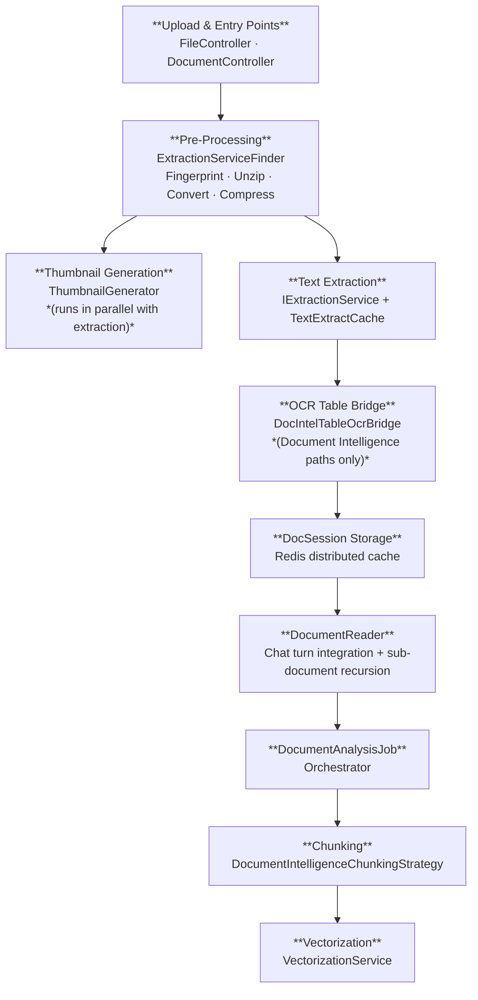

---

## Stage 1 — Upload & Entry Points

### FileController
`Controllers/FileController.cs`

Manages a user's in-session document store. Supports listing, uploading, deleting, and inspecting uploaded files. Delegates persistence to `IDocSession`.

Routes: `GET /file`, `GET /file/Info`, `DELETE /file`, `POST /file`

### DocumentController
`Controllers/DocumentController.cs`

The richer analysis entry point. Accepts uploaded files *or* URLs, dispatches to `DocumentAnalysisJob`, and returns structured results.

| Route | Purpose |
|---|---|
| `POST /Document/Analyze` | Full pipeline — extract, analyze, optionally aggregate |
| `POST /Document/Extract/Text` | Text extraction only |
| `POST /Document/AnalyzeLinks` | Download from URLs then analyze |
| `POST /Document/Extract/TextFromLinks` | Download from URLs then extract text |
| `GET /Document/StructuredCache/{quality}/{fingerprint}` | Re-chunk a previously cached extraction |

Supports password-protected documents and per-request cache bypass (`noCache=true`).

---

## Stage 2 — Pre-Processing & Fingerprinting

`Domain/DataExtractionServices/ExtractionServiceFinder.cs`

`ExtractionServiceFinder.PreProcessAsync` normalizes the raw file upload through a fixed sequence of stages before any extraction begins:

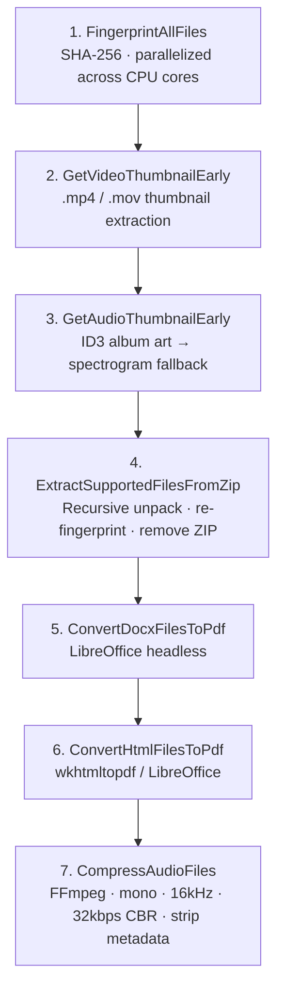

Thumbnails are extracted early (steps 2–3) so the UI has a preview before the potentially slow extraction pipeline completes.

### External Tool Dependencies

| Tool | Purpose |
|---|---|
| **LibreOffice** (headless) | DOCX → PDF, HTML → PDF (fallback) |
| **wkhtmltopdf** | HTML → PDF (primary) |
| **FFmpeg** | Audio normalization, video thumbnail extraction |

---

## Stage 3 — Thumbnail Generation

`Domain/DataExtractionServices/Thumbnails/ThumbnailGenerator.cs`

Runs in parallel with text extraction — does not block the extraction path. The result is stored in `ExtractOptions` under the `b64Thumbnail` key and flows through to chat history metadata for UI document preview icons.

| File Type | Strategy |
|---|---|
| PDF | Docnet.Core — rasterizes first page |
| Images | SixLabors.ImageSharp — loads and scales |
| PPTX | Reads embedded slide thumbnail from PPTX ZIP archive |
| Video | FFmpeg — extracts frame at 1-second mark |
| Audio | ID3 embedded album art → FFmpeg spectrogram → generic icon |
| Text | Renders text preview as PNG with font scaling and character cap |
| ZIP | Generic icon |

Thumbnails have a three-tier cache: in-memory → distributed (Redis) → blob storage. Cache key is derived from file fingerprint. Settings are under `ThumbnailSettings` (max width/height, JPEG quality).

---

## Stage 4 — Text Extraction

### Quality Tiers

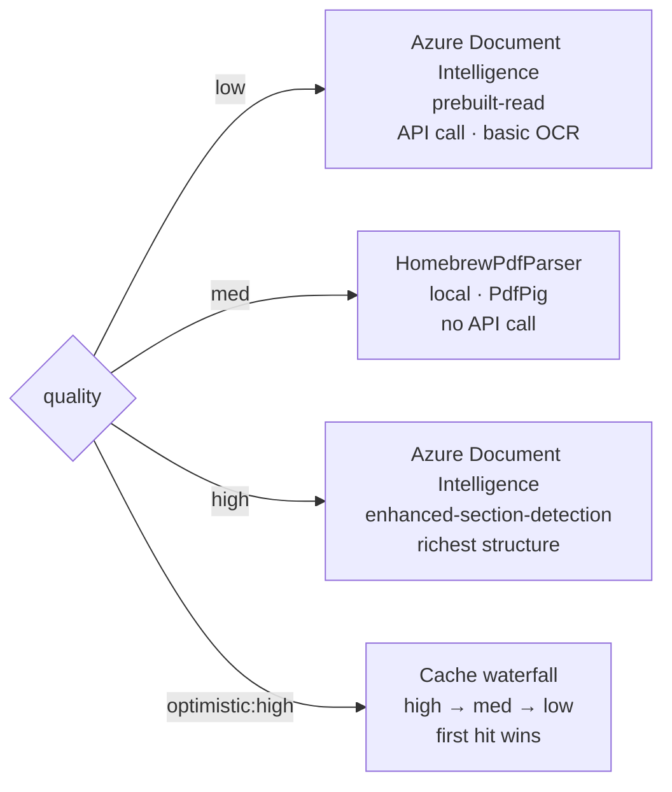

`med` is notable: it runs entirely in-process with no Document Intelligence API call, making it the fastest and cheapest option where layout fidelity is sufficient. `high` returns the richest structured output (paragraphs, section headings, tables with bounding geometry) that the semantic chunker and OCR Table Bridge can fully exploit.

### The Cache Waterfall

`Persistence/DocSession/TextExtractCache.cs`  
`Persistence/DocSession/DocumentIntelligenceCache.cs`

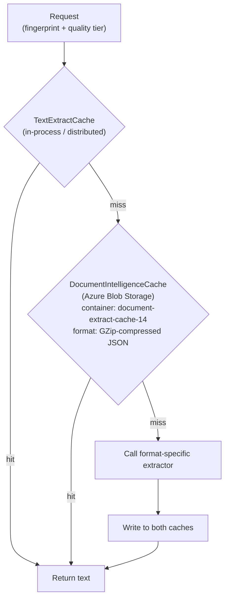

**OCR Table Bridge versioning** — if the table-to-Markdown conversion logic changes, cache entries are treated as stale regardless of fingerprint match. Only relevant to `low` and `high` paths; `med` (HomebrewPdfParser) does not go through the table bridge.

### The Extraction Sentinel

`Persistence/DocSession/Sentinel/`

Prevents duplicate concurrent extractions of the same document.

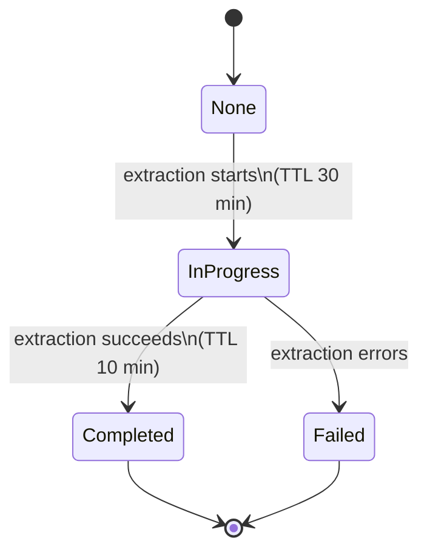

Other threads arriving for the same fingerprint wait on `WaitForCompletionAsync` (up to 60 seconds). The chat UI receives progress messages via `ChatContext.SignalChatStatusMessage` while waiting.

### Format-Specific Extractors

`Domain/DataExtractionServices/Targets/`

#### PDF — `PdfTextExtractionService`

**HomebrewPdfParser** (`PdfTextExtractionService.HomeBrewPdfParser.cs`) uses PdfPig with:

- `DocstrumBoundingBoxes` for page segmentation
- `NearestNeighbourWordExtractor` for word positioning
- `DefaultReadingOrderDetector` for reading order inference
- Vertical gap clustering to detect tables (multiplier on page average font size)
- Regex-based key-value pair extraction (`KEY - VALUE`, `KEY: VALUE` patterns)
- Section heading detection via Levenshtein distance against a known non-heading word list, combined with capitalization and length heuristics

Records `ModelId = "enhanced-section-detection"` in its `AnalyzeResult` so downstream components treat its output consistently with the Document Intelligence high-quality path. Version: `1.0.1`.

**Password-protected PDFs** — The password is passed as a query parameter (`?p=mypassword`). For multi-file uploads, one `p` value per file in order. Uses iText `ReaderProperties.SetPassword()` with UTF-8 encoding, runs a test-extract to validate before full processing, and throws `PdfPasswordException` on failure. `FileController` translates this to HTTP `423 Locked`.

#### Images — `ImageToTextExtractService`

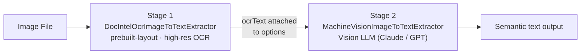

Images set `noCache=true` automatically — extraction is always live. The `isImage=1` metadata flag is set for downstream consumers. Images discovered embedded inside PDFs are pushed back onto the document stack for recursive processing (see DocumentReader).

#### Audio — `AudioExtractionService`

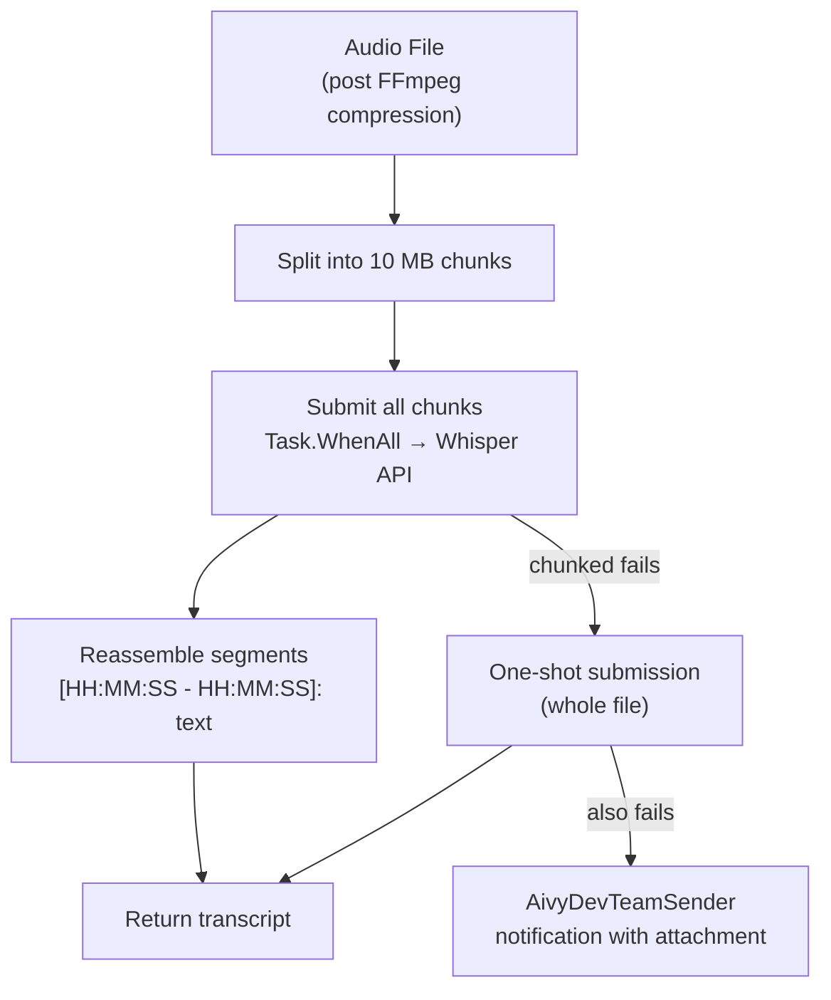

- **Chunk size**: 10 MB (Whisper's limit is 25 MB; smaller chunks maximize parallelism)
- **Model**: configurable via `AudioExtractionService:Model` (default: `whisper-1`)
- **Metadata**: `isAudio=true`, `source=transcription`, `whisperModel`

#### HTML — `HtmlExtractionService`

Before extraction, `HtmlCompression` aggressively prunes the DOM:

- Hidden elements (`display:none`, `visibility:hidden`)
- Inline wrapper elements with no semantic value
- `data-*` and `aria-*` attributes
- Office XML namespaces (common in Word-exported HTML)
- Empty elements

Significantly reduces token footprint before text is handed to the LLM.

#### Other formats

| Extractor | File Types |
|---|---|
| `WordTextExtractionService` | DOCX |
| `MicrosoftOfficeExtractionService` | PPTX |
| `TextFileExtractionService` | Plain text |

---

## Stage 5 — OCR Table Bridge

`Domain/DataExtractionServices/TableBridge/DocIntelTableOcrBridge.cs`

Post-processes `AnalyzeResult` output from Document Intelligence (`low` and `high` paths only). Raw Document Intelligence output represents tables and paragraphs as separate objects whose spatial relationship is encoded only in bounding polygon geometry.

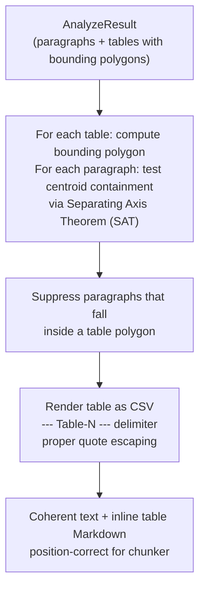

**Cache versioning** — the bridge has a hardcoded version string (`"20251210"`, YYYYMMDD). This is stored as metadata on every blob cache entry. On cache reads, a version mismatch is treated as a miss and re-extraction is triggered automatically. A code change to table rendering logic invalidates all stale cached documents without manual cache purging.

---

## Stage 6 — Document Session & DocumentReader

### DocSession

`Persistence/DocSession/`

After extraction, the `DocEntry` record (userId, name, MIME type, raw bytes, extracted text, metadata) is stored in the distributed cache via `IDocSession`.

| Flow | Cache Key |
|---|---|
| Standard | `userId` |
| Ask-Aivy | `userId + chatId` — per-conversation isolation |

### DocumentReader

`Domain/Services/DocumentReader.cs`

At chat-turn time, pops documents from the user's session and appends extracted text to `ChatHistory`. Also:

- Downloads hyperlinks from the user's last message (concurrent, 100s timeout)
- Pushes thumbnail images to the block-based UI
- Attaches metadata (filename, MIME type, thumbnail, source) to chat history entries

**Sub-document extraction** — when block mode is enabled, images embedded inside PDFs are extracted and pushed back onto the document processing stack (`snappedEntriesStack`) for recursive processing. Each re-queued image entry carries origin metadata (page number, image index). This routes embedded charts and diagrams through the full two-stage image pipeline rather than silently dropping them.

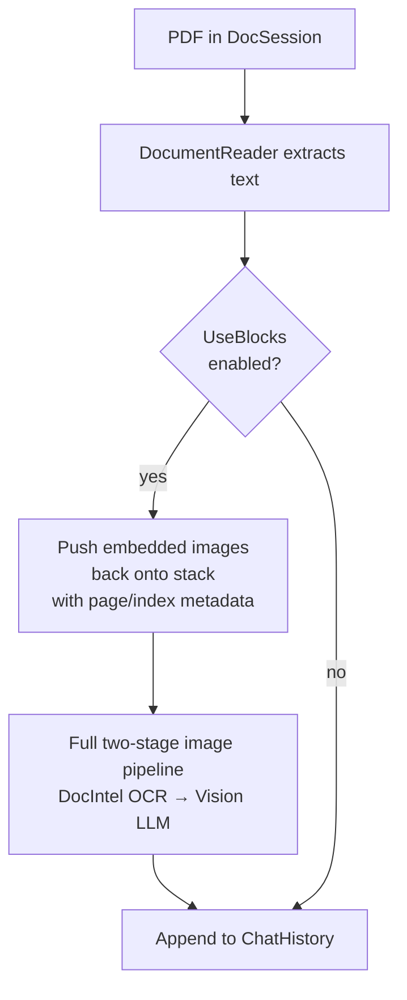

---

## Stage 7 — Document Analysis Job

`Domain/DocumentAnalysis/DocumentAnalysisJob.cs`

Central orchestrator. Accepts a file collection and dispatches based on `DocumentAnalysisJobType` (a `[Flags]` enum — combinations like `Chunk | Vectorize` are valid):

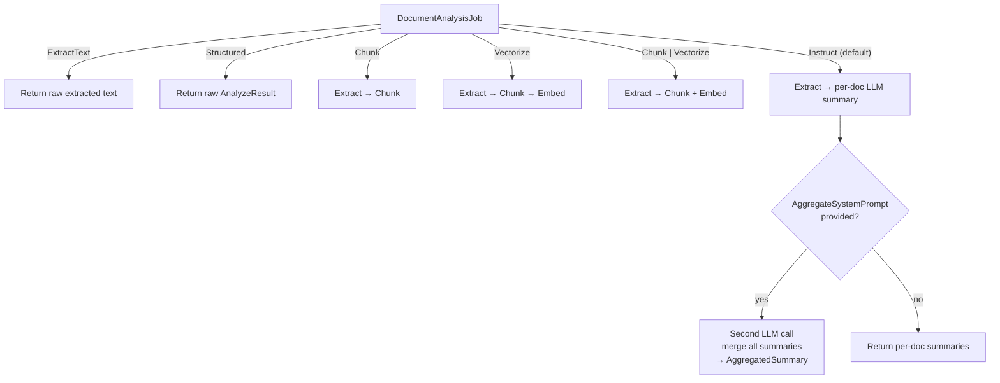

---

## Stage 8 — Chunking

`Domain/DocumentAnalysis/Chunking/`

### Settings

| Setting | Default | Purpose |
|---|---|---|
| `MinChunkSize` | 600 chars | Minimum before flushing a chunk |
| `MaxChunkSize` | 1200 chars | Hard cap per chunk |
| `OverlapPercentage` | 0.05 (5%) | Context carried across chunk boundaries |
| `SentenceBreaks` | `.` `!` `?` | Acceptable split points |

### DocumentIntelligenceChunkingStrategy

`Domain/DocumentAnalysis/Chunking/DocumentIntelligenceChunkingStrategy.cs`

Uses the structured output from Document Intelligence to chunk semantically rather than by character count:

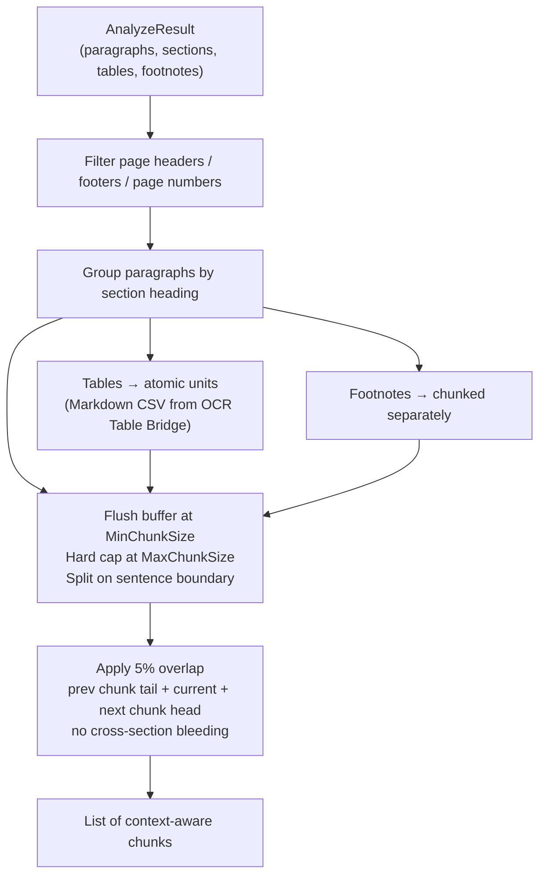

Benefits most from `high` quality extraction where Document Intelligence provides full structural metadata. At `med` quality (HomebrewPdfParser), structural metadata is locally derived and may be less precise, causing the chunker to fall back toward size-based splitting at ambiguous boundaries.

Three older strategies remain in the codebase (`LineBasedChunkingStrategy`, `ParagraphOverlapChunkingStrategy`, `LlmChunkingStrategy`) but are not registered as active.

---

## Stage 9 — Vectorization

`Domain/DocumentAnalysis/Vectorization/VectorizationService.cs`

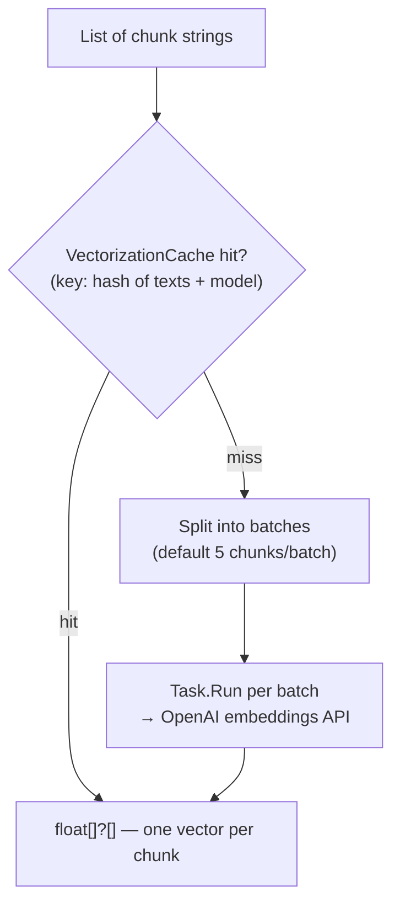

If a request specifies a different embedding model than the configured default, a transient `EmbeddingClient` is created for that call rather than reusing the singleton.

| Setting | Default |
|---|---|
| `VectorizationOptions:DefaultVectorizationModel` | Configured (e.g., `text-embedding-3-small`) |
| `VectorizationOptions:VectorizationBatchSize` | 5 |

---

## Key Design Decisions

**`med` quality uses a local parser — no API call**  
HomebrewPdfParser runs in-process with no external dependency. Faster and cheaper than either Document Intelligence tier; the tradeoff is less structural metadata for the chunker.

**Optimistic cache waterfall**  
`quality=optimistic:high` gracefully degrades rather than failing on a cache miss. Callers get the best available cached result without needing to know cache state.

**Fingerprint-based deduplication**  
SHA-256 on raw bytes means the same file uploaded twice, or by two different users, is extracted once. Cache is shared at the document level, not the session level.

**Semantic chunking over naive splitting**  
Using Document Intelligence paragraph/section structure preserves meaning at boundaries. A naive 1200-character split would frequently cut mid-sentence or mid-table. Best results come from `high` quality extraction feeding the chunker.

**OCR Table Bridge as a separable versioned component**  
Decoupling table rendering from extraction means the conversion logic can be updated and cache entries invalidated automatically via the version string — without touching extraction code or manually purging the cache.

**Two-stage image extraction**  
Running Document Intelligence OCR first and passing its output as grounding context to the vision LLM in stage two reduces hallucination and improves accuracy on complex images (charts, tables, forms).

**Sentinel prevents thundering herd**  
If multiple users upload the same document simultaneously, only one extraction call is made; the rest wait on the sentinel.

**Sub-document recursion for embedded images**  
Rather than handling images embedded in PDFs as a special case inside the PDF extractor, they are pushed back onto the document stack and processed through the full image pipeline. Embedded charts and diagrams benefit from future improvements to the image pipeline automatically.

**Audio chunking below the Whisper limit**  
10 MB chunks rather than Whisper's 25 MB maximum keeps individual API calls fast and allows full parallelism. The single-call fallback exists as a safety net for edge cases where chunking itself fails.

**Private metadata convention**  
Metadata keys prefixed with `_` are excluded when metadata is surfaced to chat history, allowing internal tracking without polluting user-visible context.

**Ask-Aivy conversation partitioning**  
Documents scoped to `userId+chatId` ensure documents uploaded in one conversation are not visible in another.

**Flags enum for job types**  
`DocumentAnalysisJobType` is a `[Flags]` enum so callers can combine `Chunk | Vectorize` in a single job without two separate API calls.

---

## ExtractOptions — The Context Envelope

`Domain/DataExtractionServices/ExtractOptions.cs`

A metadata dictionary that flows through the entire pipeline (extraction → table bridge → chunking → vectorization):

| Key | Purpose |
|---|---|
| `fingerprint` | SHA-256 hash of document bytes |
| `quality` | Extraction tier (low / med / high / optimistic) |
| `p` | Password for encrypted PDFs |
| `b64Thumbnail` | Base64 thumbnail for UI display |
| `tokenCount` | Extracted text token count |
| `noCache` | Bypass cache for this request |
| `reasoningEffort` | `low/medium/high` for GPT-5-series models |
| `ocrText` | OCR output passed from DocIntel stage to vision LLM stage (images) |
| `isAudio` | Flags audio-sourced documents downstream |
| `isImage` | Flags image-sourced documents downstream |

The attached `AnalyzeResult` (when present from `low`/`high` Document Intelligence extraction) carries the complete structured output through the pipeline without re-fetching, enabling both the OCR Table Bridge and chunking strategy to operate on full structural data.

---

## File Map

| Area | Path |
|---|---|
| Upload entry point | `Controllers/FileController.cs` |
| Analysis entry point | `Controllers/DocumentController.cs` |
| DocSession interface | `Persistence/DocSession/IDocSession.cs` |
| DocEntry record | `Persistence/DocSession/DocEntry.cs` |
| Text extract cache | `Persistence/DocSession/TextExtractCache.cs` |
| Document Intelligence cache | `Persistence/DocSession/DocumentIntelligenceCache.cs` |
| Extraction sentinel | `Persistence/DocSession/Sentinel/` |
| Extraction service finder | `Domain/DataExtractionServices/ExtractionServiceFinder.cs` |
| ExtractOptions | `Domain/DataExtractionServices/ExtractOptions.cs` |
| PDF extractor | `Domain/DataExtractionServices/Targets/PdfTextExtractionService.cs` |
| HomebrewPdfParser | `Domain/DataExtractionServices/Targets/PdfTextExtractionService.HomeBrewPdfParser.cs` |
| Image extractor | `Domain/DataExtractionServices/Targets/ImageToTextExtractService.cs` |
| DocIntel OCR sub-extractor | `Domain/DataExtractionServices/Targets/Image/DocIntelOcrImageToTextExtractor.cs` |
| Vision LLM sub-extractor | `Domain/DataExtractionServices/Targets/Image/MachineVisionImageToTextExtractor.cs` |
| Audio extractor | `Domain/DataExtractionServices/Targets/AudioExtractionService.cs` |
| HTML extractor | `Domain/DataExtractionServices/Targets/HtmlExtractionService.cs` |
| OCR Table Bridge | `Domain/DataExtractionServices/TableBridge/DocIntelTableOcrBridge.cs` |
| Thumbnail generator | `Domain/DataExtractionServices/Thumbnails/ThumbnailGenerator.cs` |
| DocumentReader | `Domain/Services/DocumentReader.cs` |
| Analysis orchestrator | `Domain/DocumentAnalysis/DocumentAnalysisJob.cs` |
| Chunking strategy | `Domain/DocumentAnalysis/Chunking/DocumentIntelligenceChunkingStrategy.cs` |
| Chunking settings | `Domain/DocumentAnalysis/Chunking/ChunkingSettings.cs` |
| Vectorization service | `Domain/DocumentAnalysis/Vectorization/VectorizationService.cs` |
